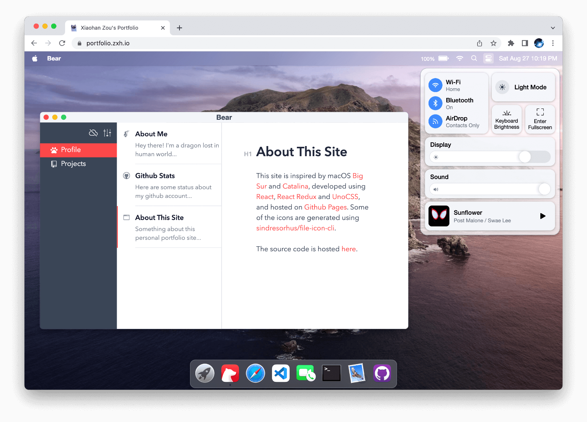

# playground-macos

My portfolio website simulating macOS's GUI: https://portfolio.zxh.io

Powered by [React](https://reactjs.org/) + [Zustand](https://zustand-demo.pmnd.rs/) + [UnoCSS](https://uno.antfu.me/) + [TypeScript](https://www.typescriptlang.org/) + [Vite](https://vitejs.dev/).




&nbsp;

## Usage

Clone the repo and install dependencies:

```bash
pnpm install
```

Start dev server (with hot reloading):

```bash
pnpm dev
```

Build for production with minification to the `dist` folder:

```bash
pnpm build
```


&nbsp;

## Changelog

- **Update 2023.06.26**: Improve [FaceTime](https://support.apple.com/en-us/HT208176).

- **Update 2023.06.25**: Add [Typora](https://typora.io/), built on top of [Milkdown](https://milkdown.dev/).

- **Update 2021.12.05**: Simulated the device's actual battery state using [Battery API](https://developer.mozilla.org/en-US/docs/Web/API/Battery_Status_API), displaying 100% charge on [unsupported browsers](https://developer.mozilla.org/en-US/docs/Web/API/Battery_Status_API#browser_compatibility).

- **Update 2021.12.05**: Refactored for cleaner code by utilizing functional components and hooks. Refer to [this branch](https://github.com/Renovamen/playground-macos/tree/class-component) for the previous version implemented with class components.


&nbsp;

## Credits

- macOS
  - [Monterey](https://www.apple.com/macos/monterey/)
  - [Catalina](https://www.apple.com/bw/macos/catalina/)
- [macOS Icon Gallery](https://www.macosicongallery.com/)
- [sindresorhus/file-icon-cli](https://github.com/sindresorhus/file-icon-cli)
- [vivek9patel.github.io](https://github.com/vivek9patel/vivek9patel.github.io)


&nbsp;

## License

[MIT](MIT)
